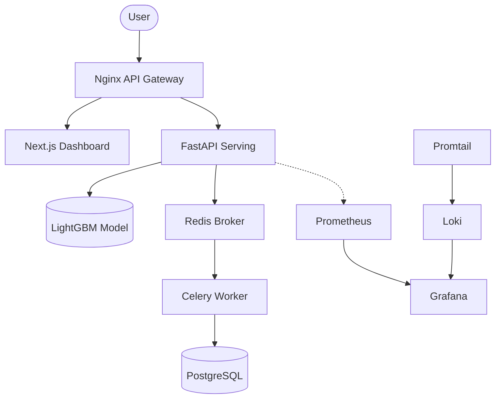

# System Architecture - Enterprise Churn Prediction

## 1. High-Level Architecture
The system follows a modern **Microservices** and **Event-Driven** pattern, containerized using Docker and orchestrated via Docker Compose.

## 2. Core Components

### API Gateway (Nginx)
The single entry point for the system. It handles reverse proxying, SSL termination (optional), and routing:
- `/` -> Served by the Frontend service.
- `/api/` -> Routed to the FastAPI backend.

### ML Serving (FastAPI)
A high-performance Python API that handles:
- Real-time feature engineering.
- Rapid model inference.
- Triggering asynchronous background tasks.

### Distributed Task Queue (Celery & Redis)
To avoid blocking the main API thread, heavy operations are offloaded:
- **SHAP Explanation**: Complex SHAP calculations can be performed by workers.
- **Persistence logging**: Every prediction is logged to the DB asynchronously to ensure sub-200ms API response times.

### Persistence Layer (PostgreSQL)
A relational database used to store:
- **Inference Logs**: Customer inputs, probabilities, and risk factors.
- **Audit Trails**: For regulatory or business review.

### Observability Stack (Loki, Prometheus, Grafana)
- **Prometheus**: Collects ML-specific metrics (churn rate, latency, model drift).
- **Loki**: Aggregates logs from all containers (API, Frontend, Nginx, DB).
- **Grafana**: A unified dashboard providing 360-degree visibility.

## 3. Data Flow
1. User interacts with the **Next.js Dashboard**.
2. Request is routed through **Nginx** to the **FastAPI** `/predict` endpoint.
3. FastAPI performs **Feature Engineering** on-the-fly.
4. **LightGBM** model returns a churn probability.
5. FastAPI triggers a **Celery Task** to save the prediction to **Postgres** and returns the result to the user.
6. **Prometheus** scrapes the metric endpoint to update churn trends in real-time.